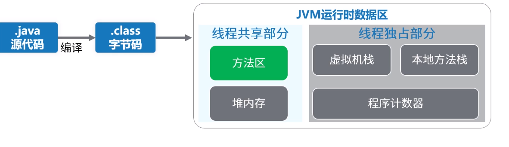

java程序运行原理, class文件内容，JVM运行时数据区域
<!-- more -->
## class文件内容
- 版本
- 访问标志(public, private等)
- 常量池(类中的静态常量，如类名，字段名)
- 当前类
- 超级类
- 接口
- 字段
- 方法
- 属性

实践Demo.java
```
// 编译
javac Demo.java
javap -v Demo.class
```

## JVM运行时数据区


1. 方法区
   不通虚拟机有不同的实现，java8存在于元数据空间。

2. 堆内存
   Old, Young[Eden, S0, S1]  
   线程共享，但存在TLAB(线程独享分配缓存，无锁分配)

3. 虚拟机栈
   每个线程由多个栈帧组成，每个栈帧对应一个方法  
   栈帧包括：局部变量表， 操作数栈， 动态链接， 方法返回地址， 附加信息

4. 本地方法栈
   与虚拟机栈相似，为Native本地方法准备

5. 程序计数器
   记录当前线程执行执行字节码的位置  
   如果是native方法，则计数器值为空
   
   
