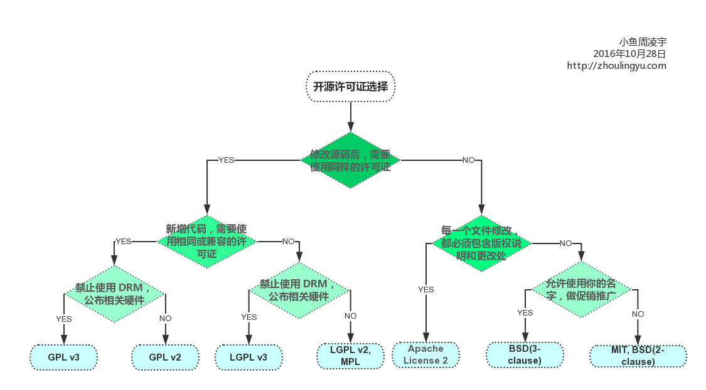

什么是软件许可协议？
通俗来讲，许可协议是指用来授权其他人具有某种使用你的作品的权利。

依靠许可协议将你的作品对外开源或者对你的作品的各个方面逐一进行授权，是一个不错的方法(WordPress, Drupal 和许多其它的内容管理系统都是开源软件)。一旦对外开源，你将失去所有对你的作品的版权，别人也没有义务将你标注为作品的原创者或捐献者。
<!-- more -->
开源许可协议 使人们免去了研究那些专业的许可条款的麻烦，使人们更方便的对开源项目贡献出自己的代码。而且它还能保护你作为作品的原创作者，确保你至少拥有由于贡献参与而带来的署名荣誉。它还能用来阻止其他人企图声明对你的作品拥有所有权的行为。

但是很多的软件作者和设计者都对各种不同的开源许可协议的内容和含义不甚了了。当你选择了某种开源许可协议时，你都放弃了哪些权力？在没有能明白各种开源协议的确切含义前，在不知道它们最适用于什么情况下时，软件开发者不可能在关于哪个许可协议最适合自己的软件的问题上做出准确的抉择。

为此花了些时间，收集整理了5种开源协议，具体内容如下：

## BSD开源协议（original BSD license、FreeBSD license、Original BSD license）
BSD开源协议是一个给于使用者很大自由的协议。基本上使用者可以”为所欲为”,可以自由的使用，修改源代码，也可以将修改后的代码作为开源或者专有软件再发布。

但”为所欲为”的前提当你发布使用了BSD协议的代码，或则以BSD协议代码为基础做二次开发自己的产品时，需要满足三个条件：

如果再发布的产品中包含源代码，则在源代码中必须带有原来代码中的BSD协议。
如果再发布的只是二进制类库/软件，则需要在类库/软件的文档和版权声明中包含原来代码中的BSD协议。
不可以用开源代码的作者/机构名字和原来产品的名字做市场推广。
BSD 代码鼓励代码共享，但需要尊重代码作者的著作权。BSD由于允许使用者修改和重新发布代码，也允许使用或在BSD代码上开发商业软件发布和销售，因此是对 商业集成很友好的协议。而很多的公司企业在选用开源产品的时候都首选BSD协议，因为可以完全控制这些第三方的代码，在必要的时候可以修改或者二次开发。

## Apache Licence 2.0（Apache License, Version 2.0、Apache License, Version 1.1、Apache License, Version 1.0）
Apache Licence是著名的非盈利开源组织Apache采用的协议。该协议和BSD类似，同样鼓励代码共享和尊重原作者的著作权，同样允许代码修改，再发布（作为开源或商业软件）。需要满足的条件也和BSD类似：

需要给代码的用户一份Apache Licence
如果你修改了代码，需要再被修改的文件中说明。
在延伸的代码中（修改和有源代码衍生的代码中）需要带有原来代码中的协议，商标，专利声明和其他原来作者规定需要包含的说明。
如果再发布的产品中包含一个Notice文件，则在Notice文件中需要带有Apache Licence。你可以在Notice中增加自己的许可，但不可以表现为对Apache Licence构成更改。
Apache Licence也是对商业应用友好的许可。使用者也可以在需要的时候修改代码来满足需要并作为开源或商业产品发布/销售。

## GPL（GNU General Public License）
我们很熟悉的Linux就是采用了GPL。GPL协议和BSD, Apache Licence等鼓励代码重用的许可很不一样。GPL的出发点是代码的开源/免费使用和引用/修改/衍生代码的开源/免费使用，但不允许修改后和衍生的代码做为闭源的商业软件发布和销售。这也就是为什么我们能用免费的各种linux，包括商业公司的linux和linux上各种各样的由个人，组织，以及商 业软件公司开发的免费软件了。

GPL协议的主要内容是只要在一个软件中使用(“使用”指类库引用，修改后的代码或者衍生代码)GPL 协议的产品，则该软件产品必须也采用GPL协议，既必须也是开源和免费。这就是所谓的”传染性”。GPL协议的产品作为一个单独的产品使用没有任何问题，还可以享受免费的优势。

由于GPL严格要求使用了GPL类库的软件产品必须使用GPL协议，对于使用GPL协议的开源代码，商业软件或者对代码有保密要求的部门就不适合集成/采用作为类库和二次开发的基础。

其它细节如再发布的时候需要伴随GPL协议等和BSD/Apache等类似。

## LGPL（GNU Lesser General Public License）
LGPL是GPL的一个为主要为类库使用设计的开源协议。和GPL要求任何使用/修改/衍生之GPL类库的的软件必须采用GPL协议不同。LGPL 允许商业软件通过类库引用(link)方式使用LGPL类库而不需要开源商业软件的代码。这使得采用LGPL协议的开源代码可以被商业软件作为类库引用并 发布和销售。

但是如果修改LGPL协议的代码或者衍生，则所有修改的代码，涉及修改部分的额外代码和衍生的代码都必须采用LGPL协议。因此LGPL协议的开源 代码很适合作为第三方类库被商业软件引用，但不适合希望以LGPL协议代码为基础，通过修改和衍生的方式做二次开发的商业软件采用。

GPL/LGPL都保障原作者的知识产权，避免有人利用开源代码复制并开发类似的产品

## MIT（MIT）
MIT是和BSD一样宽范的许可协议,作者只想保留版权,而无任何其他了限制.也就是说,你必须在你的发行版里包含原许可协议的声明,无论你是以二进制发布的还是以源代码发布的.

## 开源协议对比图
认识了以上5种协议之后，再来看看oschina制作的针对目前主流开源协议的对比图：
<!-- -->


## 参考内容
http://baike.baidu.com/view/1373538.htm
http://www.awflasher.com/blog/archives/939
http://www.aqee.net/a-short-guide-to-open-source-and-similar-licenses/
http://www.oschina.net/news/27273/main-os-license-comparison
https://www.zhihu.com/question/19568896

转载自<http://jokerliang.com/developers-will-know-5-kinds-of-open-source-licenses.html>
